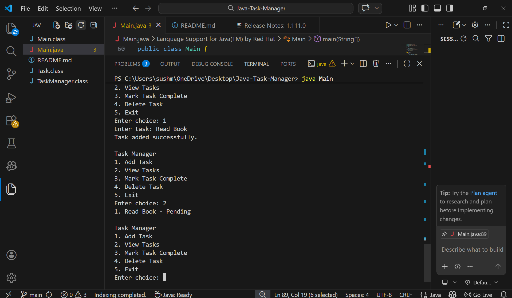

# Java Task Manager

A console-based task management application built using Core Java.  
The application allows users to manage daily tasks through a menu-driven interface in the terminal. It demonstrates fundamental Java concepts such as Object-Oriented Programming, Collections Framework, and Exception Handling.

## Features

- Add new tasks
- View existing tasks
- Mark tasks as completed
- Delete tasks
- Menu-driven console interface
- Input validation using exception handling

## Technologies Used

- Java
- Object-Oriented Programming (OOP)
- Java Collections Framework (ArrayList)
- Exception Handling
- Scanner for user input

## Project Structure

```
Java-Task-Manager
├── Main.java
├── TaskManager.java
└── Task.java
```

## How the Application Works

1. The program displays a menu in the console.
2. Users select an option to perform a specific action.
3. Tasks are stored dynamically using the Java ArrayList collection.
4. Each task contains:
   - Task title
   - Completion status (Pending or Completed)

Example Menu:

```
Task Manager
1. Add Task
2. View Tasks
3. Mark Task Complete
4. Delete Task
5. Exit
```

## How to Run the Project

1. Clone the repository

```
git clone https://github.com/SushmithaB-06/Java-Task-Manager.git
```

2. Navigate to the project directory

```
cd Java-Task-Manager
```

3. Compile the Java files

```
javac *.java
```

4. Run the application

```
java Main
```

## Application Screenshot

Example of the console output when running the Task Manager application.



## Author

Sushmitha B  
LinkedIn: https://www.linkedin.com/in/sushmitha-b-b803a7293  
GitHub: https://github.com/SushmithaB-06
